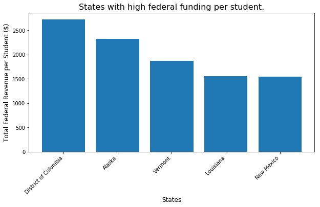
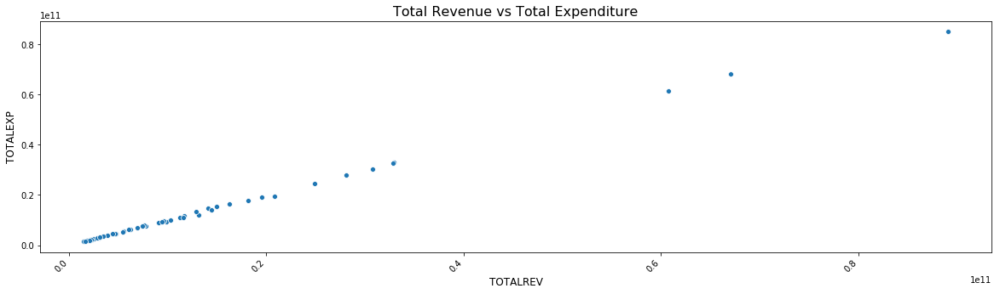
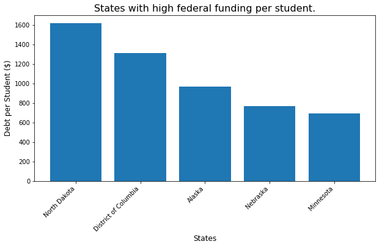
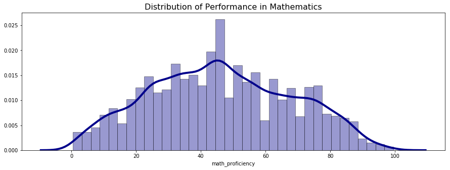
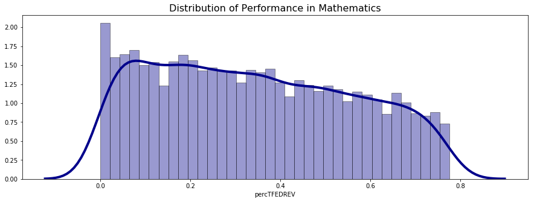

```python
import pandas as pd
import numpy as np
import matplotlib.pyplot as plt
import seaborn as sns
import re
```


```python
# Fiscal Data : https://nces.ed.gov/ccd/f33agency.asp
fiscal_data = pd.read_csv('./Data/Sdf16_1a.txt', sep='\t', low_memory=False)
```

### Problem 1
#### Import and explore the district-level fiscal data from 2015-16. Rank and visualize the states that take in the most federal funding (revenue). Which states spend the most federal funding per student?


```python
fiscal_data[['STNAME', 'V33', 'TFEDREV']][fiscal_data.TFEDREV > 0]
```


<div>
<style scoped>
    .dataframe tbody tr th:only-of-type {
        vertical-align: middle;
    }

    .dataframe tbody tr th {
        vertical-align: top;
    }

    .dataframe thead th {
        text-align: right;
    }
</style>
<table border="1" class="dataframe">
  <thead>
    <tr style="text-align: right;">
      <th></th>
      <th>STNAME</th>
      <th>V33</th>
      <th>TFEDREV</th>
    </tr>
  </thead>
  <tbody>
    <tr>
      <th>1</th>
      <td>Alabama</td>
      <td>5214</td>
      <td>7277000</td>
    </tr>
    <tr>
      <th>2</th>
      <td>Alabama</td>
      <td>5635</td>
      <td>7747000</td>
    </tr>
    <tr>
      <th>3</th>
      <td>Alabama</td>
      <td>13910</td>
      <td>6088000</td>
    </tr>
    <tr>
      <th>4</th>
      <td>Alabama</td>
      <td>10011</td>
      <td>5007000</td>
    </tr>
    <tr>
      <th>6</th>
      <td>Alabama</td>
      <td>1905</td>
      <td>1522000</td>
    </tr>
    <tr>
      <th>7</th>
      <td>Alabama</td>
      <td>2310</td>
      <td>2457000</td>
    </tr>
    <tr>
      <th>8</th>
      <td>Alabama</td>
      <td>4456</td>
      <td>971000</td>
    </tr>
    <tr>
      <th>21</th>
      <td>Alabama</td>
      <td>3102</td>
      <td>3717000</td>
    </tr>
    <tr>
      <th>36</th>
      <td>Alabama</td>
      <td>1745</td>
      <td>2360000</td>
    </tr>
    <tr>
      <th>37</th>
      <td>Alabama</td>
      <td>2099</td>
      <td>4344000</td>
    </tr>
    <tr>
      <th>38</th>
      <td>Alabama</td>
      <td>2540</td>
      <td>1544000</td>
    </tr>
    <tr>
      <th>39</th>
      <td>Alabama</td>
      <td>3933</td>
      <td>2990000</td>
    </tr>
    <tr>
      <th>46</th>
      <td>Alabama</td>
      <td>1638</td>
      <td>1940000</td>
    </tr>
    <tr>
      <th>50</th>
      <td>Alabama</td>
      <td>2953</td>
      <td>2047000</td>
    </tr>
    <tr>
      <th>53</th>
      <td>Alabama</td>
      <td>1032</td>
      <td>1619000</td>
    </tr>
    <tr>
      <th>54</th>
      <td>Alabama</td>
      <td>1308</td>
      <td>1148000</td>
    </tr>
    <tr>
      <th>55</th>
      <td>Alabama</td>
      <td>6103</td>
      <td>4244000</td>
    </tr>
    <tr>
      <th>59</th>
      <td>Alabama</td>
      <td>3034</td>
      <td>2032000</td>
    </tr>
    <tr>
      <th>60</th>
      <td>Alabama</td>
      <td>1125</td>
      <td>326000</td>
    </tr>
    <tr>
      <th>62</th>
      <td>Alabama</td>
      <td>8310</td>
      <td>4440000</td>
    </tr>
    <tr>
      <th>63</th>
      <td>Alabama</td>
      <td>9609</td>
      <td>7447000</td>
    </tr>
    <tr>
      <th>64</th>
      <td>Alabama</td>
      <td>30931</td>
      <td>23710000</td>
    </tr>
    <tr>
      <th>65</th>
      <td>Alabama</td>
      <td>912</td>
      <td>2342000</td>
    </tr>
    <tr>
      <th>66</th>
      <td>Alabama</td>
      <td>3740</td>
      <td>7480000</td>
    </tr>
    <tr>
      <th>67</th>
      <td>Alabama</td>
      <td>3322</td>
      <td>3664000</td>
    </tr>
    <tr>
      <th>68</th>
      <td>Alabama</td>
      <td>24693</td>
      <td>43262000</td>
    </tr>
    <tr>
      <th>69</th>
      <td>Alabama</td>
      <td>7870</td>
      <td>6929000</td>
    </tr>
    <tr>
      <th>70</th>
      <td>Alabama</td>
      <td>1158</td>
      <td>1045000</td>
    </tr>
    <tr>
      <th>71</th>
      <td>Alabama</td>
      <td>1505</td>
      <td>3061000</td>
    </tr>
    <tr>
      <th>72</th>
      <td>Alabama</td>
      <td>3135</td>
      <td>6439000</td>
    </tr>
    <tr>
      <th>...</th>
      <td>...</td>
      <td>...</td>
      <td>...</td>
    </tr>
    <tr>
      <th>18672</th>
      <td>Wyoming</td>
      <td>1680</td>
      <td>2209000</td>
    </tr>
    <tr>
      <th>18673</th>
      <td>Wyoming</td>
      <td>1763</td>
      <td>2625000</td>
    </tr>
    <tr>
      <th>18674</th>
      <td>Wyoming</td>
      <td>520</td>
      <td>722000</td>
    </tr>
    <tr>
      <th>18675</th>
      <td>Wyoming</td>
      <td>236</td>
      <td>438000</td>
    </tr>
    <tr>
      <th>18676</th>
      <td>Wyoming</td>
      <td>666</td>
      <td>1178000</td>
    </tr>
    <tr>
      <th>18677</th>
      <td>Wyoming</td>
      <td>1292</td>
      <td>1168000</td>
    </tr>
    <tr>
      <th>18678</th>
      <td>Wyoming</td>
      <td>607</td>
      <td>346000</td>
    </tr>
    <tr>
      <th>18679</th>
      <td>Wyoming</td>
      <td>2801</td>
      <td>2273000</td>
    </tr>
    <tr>
      <th>18680</th>
      <td>Wyoming</td>
      <td>970</td>
      <td>836000</td>
    </tr>
    <tr>
      <th>18681</th>
      <td>Wyoming</td>
      <td>906</td>
      <td>344000</td>
    </tr>
    <tr>
      <th>18682</th>
      <td>Wyoming</td>
      <td>697</td>
      <td>500000</td>
    </tr>
    <tr>
      <th>18683</th>
      <td>Wyoming</td>
      <td>115</td>
      <td>120000</td>
    </tr>
    <tr>
      <th>18684</th>
      <td>Wyoming</td>
      <td>649</td>
      <td>11726000</td>
    </tr>
    <tr>
      <th>18685</th>
      <td>Wyoming</td>
      <td>828</td>
      <td>528000</td>
    </tr>
    <tr>
      <th>18686</th>
      <td>Wyoming</td>
      <td>13417</td>
      <td>15224000</td>
    </tr>
    <tr>
      <th>18687</th>
      <td>Wyoming</td>
      <td>799</td>
      <td>999000</td>
    </tr>
    <tr>
      <th>18688</th>
      <td>Wyoming</td>
      <td>1041</td>
      <td>546000</td>
    </tr>
    <tr>
      <th>18689</th>
      <td>Wyoming</td>
      <td>1000</td>
      <td>1367000</td>
    </tr>
    <tr>
      <th>18690</th>
      <td>Wyoming</td>
      <td>1818</td>
      <td>1944000</td>
    </tr>
    <tr>
      <th>18691</th>
      <td>Wyoming</td>
      <td>2542</td>
      <td>4699000</td>
    </tr>
    <tr>
      <th>18692</th>
      <td>Wyoming</td>
      <td>5749</td>
      <td>6398000</td>
    </tr>
    <tr>
      <th>18693</th>
      <td>Wyoming</td>
      <td>90</td>
      <td>61000</td>
    </tr>
    <tr>
      <th>18694</th>
      <td>Wyoming</td>
      <td>941</td>
      <td>494000</td>
    </tr>
    <tr>
      <th>18695</th>
      <td>Wyoming</td>
      <td>3488</td>
      <td>2985000</td>
    </tr>
    <tr>
      <th>18696</th>
      <td>Wyoming</td>
      <td>409</td>
      <td>503000</td>
    </tr>
    <tr>
      <th>18697</th>
      <td>Wyoming</td>
      <td>2710</td>
      <td>2071000</td>
    </tr>
    <tr>
      <th>18698</th>
      <td>Wyoming</td>
      <td>106</td>
      <td>258000</td>
    </tr>
    <tr>
      <th>18699</th>
      <td>Wyoming</td>
      <td>2770</td>
      <td>1853000</td>
    </tr>
    <tr>
      <th>18700</th>
      <td>Wyoming</td>
      <td>268</td>
      <td>219000</td>
    </tr>
    <tr>
      <th>18701</th>
      <td>Wyoming</td>
      <td>1358</td>
      <td>1594000</td>
    </tr>
  </tbody>
</table>
<p>16539 rows × 3 columns</p>
</div>


```python
fiscal_data = fiscal_data[fiscal_data.TFEDREV > 0]
state_fiscal_data = fiscal_data.groupby('STNAME').sum().sort_values(by='TFEDREV', ascending=False)
state_fiscal_data.head()

```


<div>
<style scoped>
    .dataframe tbody tr th:only-of-type {
        vertical-align: middle;
    }

    .dataframe tbody tr th {
        vertical-align: top;
    }

    .dataframe thead th {
        text-align: right;
    }
</style>
<table border="1" class="dataframe">
  <thead>
    <tr style="text-align: right;">
      <th></th>
      <th>FIPST</th>
      <th>YEAR</th>
      <th>CCDNF</th>
      <th>CENFILE</th>
      <th>V33</th>
      <th>MEMBERSCH</th>
      <th>TOTALREV</th>
      <th>TFEDREV</th>
      <th>C14</th>
      <th>C15</th>
      <th>...</th>
      <th>_66V</th>
      <th>W01</th>
      <th>W31</th>
      <th>W61</th>
      <th>V95</th>
      <th>V02</th>
      <th>K14</th>
      <th>CE1</th>
      <th>CE2</th>
      <th>WEIGHT</th>
    </tr>
    <tr>
      <th>STNAME</th>
      <th></th>
      <th></th>
      <th></th>
      <th></th>
      <th></th>
      <th></th>
      <th></th>
      <th></th>
      <th></th>
      <th></th>
      <th></th>
      <th></th>
      <th></th>
      <th></th>
      <th></th>
      <th></th>
      <th></th>
      <th></th>
      <th></th>
      <th></th>
      <th></th>
    </tr>
  </thead>
  <tbody>
    <tr>
      <th>California</th>
      <td>6108</td>
      <td>16288</td>
      <td>1018</td>
      <td>1017</td>
      <td>6203559</td>
      <td>6187037</td>
      <td>89110947000</td>
      <td>7709275000</td>
      <td>1798207000</td>
      <td>1821197000</td>
      <td>...</td>
      <td>0</td>
      <td>4946663000</td>
      <td>10871931000</td>
      <td>29391495000</td>
      <td>0</td>
      <td>0</td>
      <td>0</td>
      <td>-1018</td>
      <td>-1018</td>
      <td>1018</td>
    </tr>
    <tr>
      <th>Texas</th>
      <td>58368</td>
      <td>19456</td>
      <td>1216</td>
      <td>1044</td>
      <td>5296442</td>
      <td>5296378</td>
      <td>60768409000</td>
      <td>6194317000</td>
      <td>1347799000</td>
      <td>847121000</td>
      <td>...</td>
      <td>3618330000</td>
      <td>2947662000</td>
      <td>12040448000</td>
      <td>18156976000</td>
      <td>1196458000</td>
      <td>0</td>
      <td>0</td>
      <td>41141377000</td>
      <td>4911673000</td>
      <td>1216</td>
    </tr>
    <tr>
      <th>New York</th>
      <td>24732</td>
      <td>10992</td>
      <td>687</td>
      <td>677</td>
      <td>2591958</td>
      <td>2572154</td>
      <td>67051220000</td>
      <td>3374794000</td>
      <td>1035611000</td>
      <td>699120000</td>
      <td>...</td>
      <td>2032288000</td>
      <td>428102000</td>
      <td>1425604000</td>
      <td>9234538000</td>
      <td>0</td>
      <td>0</td>
      <td>0</td>
      <td>-687</td>
      <td>-687</td>
      <td>687</td>
    </tr>
    <tr>
      <th>Florida</th>
      <td>804</td>
      <td>1072</td>
      <td>67</td>
      <td>67</td>
      <td>2776933</td>
      <td>2776067</td>
      <td>28125598000</td>
      <td>3147329000</td>
      <td>808874000</td>
      <td>606538000</td>
      <td>...</td>
      <td>0</td>
      <td>633122000</td>
      <td>1136097000</td>
      <td>6836238000</td>
      <td>0</td>
      <td>0</td>
      <td>0</td>
      <td>21654985000</td>
      <td>3115137000</td>
      <td>67</td>
    </tr>
    <tr>
      <th>Illinois</th>
      <td>16524</td>
      <td>15552</td>
      <td>972</td>
      <td>970</td>
      <td>2029830</td>
      <td>2007587</td>
      <td>32884195000</td>
      <td>2334945000</td>
      <td>681879000</td>
      <td>544336000</td>
      <td>...</td>
      <td>920029000</td>
      <td>1366956000</td>
      <td>1211789000</td>
      <td>12929989000</td>
      <td>0</td>
      <td>0</td>
      <td>0</td>
      <td>-971</td>
      <td>-971</td>
      <td>972</td>
    </tr>
  </tbody>
</table>
<p>5 rows × 132 columns</p>
</div>


```python
plt.figure(figsize=(20,10))
plt.bar(state_fiscal_data.index, state_fiscal_data.TFEDREV)
plt.xlabel('States', fontsize=12)
plt.ylabel('Total Federal Revenue ($)', fontsize=12)
_ = plt.xticks(
    rotation=45, 
    horizontalalignment='right',
    fontweight='light' 
)
_ = plt.title('State-wise federal funding.', fontsize = 16)
```


```python
# state spending per student

state_fiscal_data['TFEDREVperStudent'] = state_fiscal_data['TFEDREV']/state_fiscal_data['V33']
state_fiscal_data_sorted = state_fiscal_data.sort_values(by='TFEDREVperStudent', ascending=False)

plt.figure(figsize=(10,5))
plt.bar(state_fiscal_data_sorted.head().index, state_fiscal_data_sorted.head().TFEDREVperStudent)
plt.xlabel('States', fontsize=12)
plt.ylabel('Total Federal Revenue per Student ($)', fontsize=12)
_ = plt.xticks(
    rotation=45, 
    horizontalalignment='right',
    fontweight='light' 
)
_ = plt.title('States with high federal funding per student.', fontsize = 16)
```





* We observe that District of Columbia has maximum per student Federal Funding

### Problem 2
#### Visualize the relationship between school districts’ total revenue and expenditures. Which states have the most debt per student?


```python
#state_fiscal_data[['TOTALREV','TOTALEXP','V33']]
plt.figure(figsize=(20,5))
plt.xticks(
    rotation=45, 
    horizontalalignment='right',
    fontweight='light' 
)
plt.title("Total Revenue vs Total Expenditure", fontsize = 16)
plt.xlabel('Total Revenue', fontsize=12)
plt.ylabel('Total Expenditure', fontsize=12)
_ = sns.scatterplot(data = state_fiscal_data, x = 'TOTALREV', y = 'TOTALEXP') 
```





```python
sorted_debt = state_fiscal_data\
            .assign(debt_per_student = (state_fiscal_data['TOTALEXP'] - state_fiscal_data['TOTALREV'])/state_fiscal_data['V33'])


sorted_debt = sorted_debt.sort_values(by = 'debt_per_student', ascending = False)

```


```python
plt.figure(figsize=(10,5))
plt.bar(sorted_debt.head().index, sorted_debt.head().debt_per_student)
plt.xlabel('States', fontsize=12)
plt.ylabel('Debt per Student ($)', fontsize=12)
_ = plt.xticks(
    rotation=45, 
    horizontalalignment='right',
    fontweight='light' 
)
_ = plt.title('States with high federal funding per student.', fontsize = 16)
```





* We observe North Dakota has maximum Debt per student

### Problem 3
#### The district-level performance metrics from EDFacts may be useful in your decision. However, to protect student privacy, the data in these datasets has been heavily “blurred” to prevent students from being identified. Therefore, most of the numeric metrics are presented as ranges in string format. In addition, censored and missing data must be imputed.
#### Write and explain a function for processing a single column of “blurred” metrics into usable numeric values. Use it to process and then visualize the distribution of a performance metric of your choice.


```python
# EDFacts Data :  
# LEA level

math = pd.read_csv('./Data/math-achievement-lea-sy2015-16.csv', low_memory=False)
rla = pd.read_csv('./Data/rla-achievement-lea-sy2015-16.csv', low_memory=False)   
```


```python
'''
## FUNCTIONS ##
preprocessing: Takes the values from the column of “blurred” metrics into usable numeric values
               * The values here are passed to the helper function that converts the messy value into range:
                       - minimum value
                       - maximum value 
               * The average of minimum and maximum value is considered as final output.       
                
findFuncValue: This function is a helper function for preprocessing.
               It converts the value to minimum and maximum value.
               
               -`PS` value is converted to 0 (for both min and max values) here.
               - Single numeric value is saved to minimum and maximum value as it is.
               - For GE or GT minimum is value itself and maximum value is 100.
               - For LE or LT minimum is 0 and maximum value is the value itself.
               
'''

def findFuncValue(value): 

    
    if re.findall("^GE|^LE|^GT|^LT", value):
        function = re.findall("^GE|^LE|^GT|^LT", value)[0]
        min_value = re.sub("^GE|^LE|^GT|^LT", "", value)
        if function in ['GE','GT']:
            max_value = 100
        
        if function in ['LE','LT']:
            max_value = min_value
            min_value = 0
               
    
    elif re.search("-", value):
        min_value = value.split("-")[0]
        max_value = value.split("-")[1]
    
    elif value == 'PS':
        min_value = '0'
        max_value = '0'
    
    else: 
        min_value = value
        max_value = value
        
    return min_value, max_value
    
def preprocessing(value):
    min_value, max_value = findFuncValue(value)
    value = (int(min_value) + int(max_value))/2
    return value
        
    
```


```python
# imputing mean value for values hidden for privacy
math['math_proficiency'] = [preprocessing(i) for i in math.ALL_MTH00PCTPROF_1516]
math[math.math_proficiency == 0] = math.math_proficiency.mean()
```


```python
# Density plot shows distribution of proficiency of the students in Mathematics
plt.figure(figsize=(15,5))
plt.title('Distribution of Performance in Mathematics', fontsize = 16)
_ = sns.distplot(math.math_proficiency,hist=True, kde=True, 
             bins=int(180/5), color = 'darkblue', 
             hist_kws={'edgecolor':'black'},
             kde_kws={'linewidth': 4})
```





### Problem 4
#### You are tasked with cutting 15% of the U.S. federal budget currently being spent on funding school districts. How much money is this? 


```python
print(f"Total Fedral Revenue is: {int(fiscal_data.TFEDREV.sum())}")
print(f"15% of Total Fedral Revenue is: {int(fiscal_data.TFEDREV.sum()*0.15)}")
```

    Total Fedral Revenue is: 55602742000
    15% of Total Fedral Revenue is: 8340411300


#### Choose which school districts will have their funding cut and how this will be done. (You should produce a table of LEA IDs and the dollar amount by which their federal funding will be cut you do not need print the entire table.)


```python
LEAID_debts = fiscal_data\
      .assign(district_value_ex = fiscal_data['TOTALREV'] - fiscal_data['TOTALEXP']) \
      .assign(district_value_prop = (fiscal_data['TOTALREV'] - fiscal_data['TOTALEXP'])/fiscal_data['TOTALREV'])\
      .assign(dep_fed_rev = fiscal_data['TFEDREV']/fiscal_data['TOTALREV'])

```


```python
cutoff_metric = LEAID_debts[(LEAID_debts.district_value_prop > 0)  & (LEAID_debts.dep_fed_rev<0.8) & (LEAID_debts.district_value_ex < LEAID_debts.TFEDREV)].sort_values(by='district_value_prop',ascending = False)
cutoff_metric 
```


<div>
<style scoped>
    .dataframe tbody tr th:only-of-type {
        vertical-align: middle;
    }

    .dataframe tbody tr th {
        vertical-align: top;
    }

    .dataframe thead th {
        text-align: right;
    }
</style>
<table border="1" class="dataframe">
  <thead>
    <tr style="text-align: right;">
      <th></th>
      <th>LEAID</th>
      <th>CENSUSID</th>
      <th>FIPST</th>
      <th>CONUM</th>
      <th>CSA</th>
      <th>CBSA</th>
      <th>NAME</th>
      <th>STNAME</th>
      <th>STABBR</th>
      <th>SCHLEV</th>
      <th>...</th>
      <th>FL_W31</th>
      <th>FL_W61</th>
      <th>FL_V95</th>
      <th>FL_V02</th>
      <th>FL_K14</th>
      <th>FL_CE1</th>
      <th>FL_CE2</th>
      <th>district_value_ex</th>
      <th>district_value_prop</th>
      <th>dep_fed_rev</th>
    </tr>
  </thead>
  <tbody>
    <tr>
      <th>17199</th>
      <td>5000007</td>
      <td>46501240100000</td>
      <td>50</td>
      <td>50023</td>
      <td>N</td>
      <td>12740</td>
      <td>Barre Supervisory Union</td>
      <td>Vermont</td>
      <td>VT</td>
      <td>07</td>
      <td>...</td>
      <td>M</td>
      <td>M</td>
      <td>M</td>
      <td>M</td>
      <td>M</td>
      <td>M</td>
      <td>M</td>
      <td>2566000</td>
      <td>0.492609</td>
      <td>0.522749</td>
    </tr>
    <tr>
      <th>10857</th>
      <td>3500158</td>
      <td>N</td>
      <td>35</td>
      <td>35043</td>
      <td>106</td>
      <td>10740</td>
      <td>WALATOWA CHARTER HIGH</td>
      <td>New Mexico</td>
      <td>NM</td>
      <td>02</td>
      <td>...</td>
      <td>R</td>
      <td>R</td>
      <td>R</td>
      <td>R</td>
      <td>M</td>
      <td>R</td>
      <td>R</td>
      <td>803000</td>
      <td>0.424868</td>
      <td>0.586772</td>
    </tr>
    <tr>
      <th>475</th>
      <td>0400403</td>
      <td>N</td>
      <td>4</td>
      <td>04021</td>
      <td>N</td>
      <td>38060</td>
      <td>Akimel O'Otham Pee Posh Charter School Inc. 1</td>
      <td>Arizona</td>
      <td>AZ</td>
      <td>01</td>
      <td>...</td>
      <td>M</td>
      <td>M</td>
      <td>R</td>
      <td>R</td>
      <td>M</td>
      <td>M</td>
      <td>M</td>
      <td>153000</td>
      <td>0.397403</td>
      <td>0.696104</td>
    </tr>
    <tr>
      <th>17791</th>
      <td>5300013</td>
      <td>48503920100000</td>
      <td>53</td>
      <td>53077</td>
      <td>N</td>
      <td>49420</td>
      <td>Educational Service District 105</td>
      <td>Washington</td>
      <td>WA</td>
      <td>07</td>
      <td>...</td>
      <td>R</td>
      <td>R</td>
      <td>M</td>
      <td>M</td>
      <td>M</td>
      <td>M</td>
      <td>M</td>
      <td>9407000</td>
      <td>0.396769</td>
      <td>0.457337</td>
    </tr>
    <tr>
      <th>15879</th>
      <td>4800164</td>
      <td>44522120100000</td>
      <td>48</td>
      <td>48441</td>
      <td>N</td>
      <td>10180</td>
      <td>REG 14 EDUCATION SERVICE CENTER</td>
      <td>Texas</td>
      <td>TX</td>
      <td>07</td>
      <td>...</td>
      <td>R</td>
      <td>R</td>
      <td>R</td>
      <td>M</td>
      <td>M</td>
      <td>R</td>
      <td>R</td>
      <td>7571000</td>
      <td>0.373803</td>
      <td>0.558803</td>
    </tr>
    <tr>
      <th>3349</th>
      <td>1600163</td>
      <td>N</td>
      <td>16</td>
      <td>16005</td>
      <td>N</td>
      <td>38540</td>
      <td>CHIEF TAHGEE ELEMENTARY ACADEMY DISTRICT</td>
      <td>Idaho</td>
      <td>ID</td>
      <td>01</td>
      <td>...</td>
      <td>R</td>
      <td>R</td>
      <td>M</td>
      <td>M</td>
      <td>M</td>
      <td>M</td>
      <td>M</td>
      <td>781000</td>
      <td>0.371905</td>
      <td>0.572381</td>
    </tr>
    <tr>
      <th>15887</th>
      <td>4800176</td>
      <td>44524320100000</td>
      <td>48</td>
      <td>48485</td>
      <td>N</td>
      <td>48660</td>
      <td>REG 9 EDUCATION SERVICE CENTER</td>
      <td>Texas</td>
      <td>TX</td>
      <td>07</td>
      <td>...</td>
      <td>R</td>
      <td>R</td>
      <td>R</td>
      <td>M</td>
      <td>M</td>
      <td>R</td>
      <td>R</td>
      <td>4636000</td>
      <td>0.364953</td>
      <td>0.545698</td>
    </tr>
    <tr>
      <th>436</th>
      <td>0400351</td>
      <td>N</td>
      <td>4</td>
      <td>04013</td>
      <td>N</td>
      <td>38060</td>
      <td>Kaizen Education Foundation dba Vista Grove Pr...</td>
      <td>Arizona</td>
      <td>AZ</td>
      <td>01</td>
      <td>...</td>
      <td>M</td>
      <td>M</td>
      <td>R</td>
      <td>R</td>
      <td>M</td>
      <td>M</td>
      <td>M</td>
      <td>264000</td>
      <td>0.358209</td>
      <td>0.421981</td>
    </tr>
    <tr>
      <th>9151</th>
      <td>3004500</td>
      <td>27502140130200</td>
      <td>30</td>
      <td>30041</td>
      <td>N</td>
      <td>N</td>
      <td>Box Elder H S</td>
      <td>Montana</td>
      <td>MT</td>
      <td>02</td>
      <td>...</td>
      <td>R</td>
      <td>R</td>
      <td>R</td>
      <td>M</td>
      <td>M</td>
      <td>R</td>
      <td>R</td>
      <td>1102000</td>
      <td>0.357676</td>
      <td>0.544628</td>
    </tr>
    <tr>
      <th>17529</th>
      <td>5099931</td>
      <td>46501040200000</td>
      <td>50</td>
      <td>50019</td>
      <td>N</td>
      <td>N</td>
      <td>North Country Supervisory Union</td>
      <td>Vermont</td>
      <td>VT</td>
      <td>07</td>
      <td>...</td>
      <td>M</td>
      <td>M</td>
      <td>M</td>
      <td>M</td>
      <td>M</td>
      <td>M</td>
      <td>M</td>
      <td>3414000</td>
      <td>0.356628</td>
      <td>0.530764</td>
    </tr>
    <tr>
      <th>15845</th>
      <td>4800104</td>
      <td>44505720100000</td>
      <td>48</td>
      <td>48113</td>
      <td>206</td>
      <td>19100</td>
      <td>REG 10 EDUCATION SERVICE CENTER</td>
      <td>Texas</td>
      <td>TX</td>
      <td>07</td>
      <td>...</td>
      <td>R</td>
      <td>R</td>
      <td>R</td>
      <td>M</td>
      <td>M</td>
      <td>R</td>
      <td>R</td>
      <td>27134000</td>
      <td>0.345449</td>
      <td>0.654678</td>
    </tr>
    <tr>
      <th>17525</th>
      <td>5099927</td>
      <td>46500940200000</td>
      <td>50</td>
      <td>50017</td>
      <td>N</td>
      <td>17200</td>
      <td>Orange East Supervisory Union</td>
      <td>Vermont</td>
      <td>VT</td>
      <td>07</td>
      <td>...</td>
      <td>M</td>
      <td>M</td>
      <td>M</td>
      <td>M</td>
      <td>M</td>
      <td>M</td>
      <td>M</td>
      <td>1239000</td>
      <td>0.340665</td>
      <td>0.540005</td>
    </tr>
    <tr>
      <th>352</th>
      <td>0400213</td>
      <td>N</td>
      <td>4</td>
      <td>04005</td>
      <td>N</td>
      <td>22380</td>
      <td>Painted Desert Demonstration Projects  Inc.</td>
      <td>Arizona</td>
      <td>AZ</td>
      <td>01</td>
      <td>...</td>
      <td>M</td>
      <td>M</td>
      <td>R</td>
      <td>R</td>
      <td>M</td>
      <td>M</td>
      <td>M</td>
      <td>957000</td>
      <td>0.335319</td>
      <td>0.640154</td>
    </tr>
    <tr>
      <th>9340</th>
      <td>3017040</td>
      <td>27500240330200</td>
      <td>30</td>
      <td>30003</td>
      <td>N</td>
      <td>N</td>
      <td>Lodge Grass H S</td>
      <td>Montana</td>
      <td>MT</td>
      <td>02</td>
      <td>...</td>
      <td>R</td>
      <td>R</td>
      <td>R</td>
      <td>M</td>
      <td>M</td>
      <td>R</td>
      <td>R</td>
      <td>1396000</td>
      <td>0.334211</td>
      <td>0.609768</td>
    </tr>
    <tr>
      <th>711</th>
      <td>0400915</td>
      <td>N</td>
      <td>4</td>
      <td>04013</td>
      <td>N</td>
      <td>38060</td>
      <td>CASA Academy</td>
      <td>Arizona</td>
      <td>AZ</td>
      <td>01</td>
      <td>...</td>
      <td>M</td>
      <td>M</td>
      <td>R</td>
      <td>R</td>
      <td>M</td>
      <td>M</td>
      <td>M</td>
      <td>651000</td>
      <td>0.328788</td>
      <td>0.362121</td>
    </tr>
    <tr>
      <th>7656</th>
      <td>2680750</td>
      <td>23505240100000</td>
      <td>26</td>
      <td>26103</td>
      <td>N</td>
      <td>32100</td>
      <td>Marquette-Alger RESA</td>
      <td>Michigan</td>
      <td>MI</td>
      <td>07</td>
      <td>...</td>
      <td>I</td>
      <td>R</td>
      <td>R</td>
      <td>M</td>
      <td>M</td>
      <td>R</td>
      <td>R</td>
      <td>6958000</td>
      <td>0.326943</td>
      <td>0.432102</td>
    </tr>
    <tr>
      <th>9159</th>
      <td>3005010</td>
      <td>27504340230100</td>
      <td>30</td>
      <td>30085</td>
      <td>N</td>
      <td>N</td>
      <td>Brockton Elem</td>
      <td>Montana</td>
      <td>MT</td>
      <td>01</td>
      <td>...</td>
      <td>R</td>
      <td>R</td>
      <td>R</td>
      <td>M</td>
      <td>M</td>
      <td>R</td>
      <td>R</td>
      <td>630000</td>
      <td>0.324742</td>
      <td>0.507732</td>
    </tr>
    <tr>
      <th>15870</th>
      <td>4800150</td>
      <td>44516520100000</td>
      <td>48</td>
      <td>48329</td>
      <td>372</td>
      <td>33260</td>
      <td>REG 18 EDUCATION SERVICE CENTER</td>
      <td>Texas</td>
      <td>TX</td>
      <td>07</td>
      <td>...</td>
      <td>R</td>
      <td>R</td>
      <td>R</td>
      <td>M</td>
      <td>M</td>
      <td>R</td>
      <td>R</td>
      <td>9154000</td>
      <td>0.319813</td>
      <td>0.751878</td>
    </tr>
    <tr>
      <th>17519</th>
      <td>5099921</td>
      <td>46500640300000</td>
      <td>50</td>
      <td>50011</td>
      <td>N</td>
      <td>15540</td>
      <td>Franklin Northwest Supervisory Union</td>
      <td>Vermont</td>
      <td>VT</td>
      <td>07</td>
      <td>...</td>
      <td>R</td>
      <td>R</td>
      <td>M</td>
      <td>M</td>
      <td>M</td>
      <td>M</td>
      <td>M</td>
      <td>3418000</td>
      <td>0.308428</td>
      <td>0.359321</td>
    </tr>
    <tr>
      <th>15874</th>
      <td>4800156</td>
      <td>44518820100000</td>
      <td>48</td>
      <td>48381</td>
      <td>108</td>
      <td>11100</td>
      <td>REG 16 EDUCATION SERVICE CENTER</td>
      <td>Texas</td>
      <td>TX</td>
      <td>07</td>
      <td>...</td>
      <td>R</td>
      <td>R</td>
      <td>R</td>
      <td>M</td>
      <td>M</td>
      <td>I</td>
      <td>R</td>
      <td>10754000</td>
      <td>0.299479</td>
      <td>0.634716</td>
    </tr>
    <tr>
      <th>9089</th>
      <td>3000095</td>
      <td>27504430130100</td>
      <td>30</td>
      <td>30087</td>
      <td>N</td>
      <td>N</td>
      <td>Lame Deer H S</td>
      <td>Montana</td>
      <td>MT</td>
      <td>02</td>
      <td>...</td>
      <td>R</td>
      <td>R</td>
      <td>R</td>
      <td>M</td>
      <td>M</td>
      <td>R</td>
      <td>R</td>
      <td>1108000</td>
      <td>0.298652</td>
      <td>0.609164</td>
    </tr>
    <tr>
      <th>790</th>
      <td>0403150</td>
      <td>03100200230100</td>
      <td>4</td>
      <td>04003</td>
      <td>N</td>
      <td>43420</td>
      <td>Fort Huachuca Accommodation District</td>
      <td>Arizona</td>
      <td>AZ</td>
      <td>01</td>
      <td>...</td>
      <td>M</td>
      <td>I</td>
      <td>R</td>
      <td>R</td>
      <td>M</td>
      <td>M</td>
      <td>M</td>
      <td>4073000</td>
      <td>0.290534</td>
      <td>0.549183</td>
    </tr>
    <tr>
      <th>317</th>
      <td>0400147</td>
      <td>N</td>
      <td>4</td>
      <td>04019</td>
      <td>536</td>
      <td>46060</td>
      <td>Ha:san Educational Services</td>
      <td>Arizona</td>
      <td>AZ</td>
      <td>02</td>
      <td>...</td>
      <td>M</td>
      <td>M</td>
      <td>R</td>
      <td>R</td>
      <td>M</td>
      <td>M</td>
      <td>M</td>
      <td>594000</td>
      <td>0.290039</td>
      <td>0.455078</td>
    </tr>
    <tr>
      <th>12454</th>
      <td>3814520</td>
      <td>35500303200000</td>
      <td>38</td>
      <td>38005</td>
      <td>N</td>
      <td>N</td>
      <td>OBERON 16</td>
      <td>North Dakota</td>
      <td>ND</td>
      <td>01</td>
      <td>...</td>
      <td>R</td>
      <td>R</td>
      <td>M</td>
      <td>M</td>
      <td>M</td>
      <td>M</td>
      <td>M</td>
      <td>371000</td>
      <td>0.281061</td>
      <td>0.327273</td>
    </tr>
    <tr>
      <th>7638</th>
      <td>2680420</td>
      <td>23506640100000</td>
      <td>26</td>
      <td>26131</td>
      <td>N</td>
      <td>N</td>
      <td>Gogebic-Ontonagon ISD</td>
      <td>Michigan</td>
      <td>MI</td>
      <td>07</td>
      <td>...</td>
      <td>I</td>
      <td>R</td>
      <td>R</td>
      <td>M</td>
      <td>M</td>
      <td>R</td>
      <td>R</td>
      <td>3373000</td>
      <td>0.270771</td>
      <td>0.593160</td>
    </tr>
    <tr>
      <th>17507</th>
      <td>5099909</td>
      <td>46500340100000</td>
      <td>50</td>
      <td>50005</td>
      <td>N</td>
      <td>N</td>
      <td>Caledonia Central Supervisory Union</td>
      <td>Vermont</td>
      <td>VT</td>
      <td>07</td>
      <td>...</td>
      <td>M</td>
      <td>M</td>
      <td>M</td>
      <td>M</td>
      <td>M</td>
      <td>M</td>
      <td>M</td>
      <td>918000</td>
      <td>0.263869</td>
      <td>0.381431</td>
    </tr>
    <tr>
      <th>2112</th>
      <td>0632340</td>
      <td>05504905000000</td>
      <td>6</td>
      <td>06097</td>
      <td>488</td>
      <td>42220</td>
      <td>Kashia Elementary</td>
      <td>California</td>
      <td>CA</td>
      <td>01</td>
      <td>...</td>
      <td>R</td>
      <td>R</td>
      <td>M</td>
      <td>M</td>
      <td>M</td>
      <td>M</td>
      <td>M</td>
      <td>105000</td>
      <td>0.262500</td>
      <td>0.300000</td>
    </tr>
    <tr>
      <th>15880</th>
      <td>4800165</td>
      <td>44522520100000</td>
      <td>48</td>
      <td>48063</td>
      <td>N</td>
      <td>N</td>
      <td>REG 8 EDUCATION SERVICE CENTER</td>
      <td>Texas</td>
      <td>TX</td>
      <td>07</td>
      <td>...</td>
      <td>R</td>
      <td>R</td>
      <td>R</td>
      <td>M</td>
      <td>M</td>
      <td>R</td>
      <td>R</td>
      <td>2456000</td>
      <td>0.258581</td>
      <td>0.300168</td>
    </tr>
    <tr>
      <th>719</th>
      <td>0400923</td>
      <td>N</td>
      <td>4</td>
      <td>04013</td>
      <td>N</td>
      <td>38060</td>
      <td>SySTEM Schools</td>
      <td>Arizona</td>
      <td>AZ</td>
      <td>01</td>
      <td>...</td>
      <td>M</td>
      <td>M</td>
      <td>R</td>
      <td>R</td>
      <td>M</td>
      <td>M</td>
      <td>M</td>
      <td>455000</td>
      <td>0.255188</td>
      <td>0.278183</td>
    </tr>
    <tr>
      <th>15514</th>
      <td>4621300</td>
      <td>42501700900000</td>
      <td>46</td>
      <td>46033</td>
      <td>452</td>
      <td>39660</td>
      <td>Elk Mountain School District 16-2</td>
      <td>South Dakota</td>
      <td>SD</td>
      <td>03</td>
      <td>...</td>
      <td>R</td>
      <td>R</td>
      <td>R</td>
      <td>R</td>
      <td>R</td>
      <td>M</td>
      <td>M</td>
      <td>96000</td>
      <td>0.251309</td>
      <td>0.369110</td>
    </tr>
    <tr>
      <th>...</th>
      <td>...</td>
      <td>...</td>
      <td>...</td>
      <td>...</td>
      <td>...</td>
      <td>...</td>
      <td>...</td>
      <td>...</td>
      <td>...</td>
      <td>...</td>
      <td>...</td>
      <td>...</td>
      <td>...</td>
      <td>...</td>
      <td>...</td>
      <td>...</td>
      <td>...</td>
      <td>...</td>
      <td>...</td>
      <td>...</td>
      <td>...</td>
    </tr>
    <tr>
      <th>10462</th>
      <td>3408430</td>
      <td>31501001900000</td>
      <td>34</td>
      <td>34019</td>
      <td>408</td>
      <td>35620</td>
      <td>Lebanon Borough School District</td>
      <td>New Jersey</td>
      <td>NJ</td>
      <td>01</td>
      <td>...</td>
      <td>R</td>
      <td>R</td>
      <td>M</td>
      <td>M</td>
      <td>M</td>
      <td>R</td>
      <td>R</td>
      <td>1000</td>
      <td>0.000351</td>
      <td>0.017532</td>
    </tr>
    <tr>
      <th>9856</th>
      <td>3301860</td>
      <td>30200400130100</td>
      <td>33</td>
      <td>33007</td>
      <td>N</td>
      <td>13620</td>
      <td>Berlin School District</td>
      <td>New Hampshire</td>
      <td>NH</td>
      <td>03</td>
      <td>...</td>
      <td>R</td>
      <td>R</td>
      <td>M</td>
      <td>M</td>
      <td>M</td>
      <td>M</td>
      <td>M</td>
      <td>7000</td>
      <td>0.000348</td>
      <td>0.135848</td>
    </tr>
    <tr>
      <th>11913</th>
      <td>3630540</td>
      <td>33505200400000</td>
      <td>36</td>
      <td>36103</td>
      <td>408</td>
      <td>35620</td>
      <td>WEST BABYLON UNION FREE SCHOOL DISTRICT</td>
      <td>New York</td>
      <td>NY</td>
      <td>03</td>
      <td>...</td>
      <td>R</td>
      <td>R</td>
      <td>M</td>
      <td>M</td>
      <td>M</td>
      <td>M</td>
      <td>M</td>
      <td>36000</td>
      <td>0.000346</td>
      <td>0.022416</td>
    </tr>
    <tr>
      <th>17418</th>
      <td>5007470</td>
      <td>46500401500000</td>
      <td>50</td>
      <td>50007</td>
      <td>N</td>
      <td>15540</td>
      <td>South Burlington School District</td>
      <td>Vermont</td>
      <td>VT</td>
      <td>03</td>
      <td>...</td>
      <td>R</td>
      <td>R</td>
      <td>M</td>
      <td>M</td>
      <td>M</td>
      <td>M</td>
      <td>M</td>
      <td>17000</td>
      <td>0.000335</td>
      <td>0.025152</td>
    </tr>
    <tr>
      <th>5819</th>
      <td>2200030</td>
      <td>19500100100000</td>
      <td>22</td>
      <td>22001</td>
      <td>318</td>
      <td>29180</td>
      <td>Acadia Parish</td>
      <td>Louisiana</td>
      <td>LA</td>
      <td>03</td>
      <td>...</td>
      <td>R</td>
      <td>R</td>
      <td>R</td>
      <td>R</td>
      <td>R</td>
      <td>M</td>
      <td>M</td>
      <td>31000</td>
      <td>0.000320</td>
      <td>0.154309</td>
    </tr>
    <tr>
      <th>7007</th>
      <td>2601019</td>
      <td>N</td>
      <td>26</td>
      <td>26065</td>
      <td>330</td>
      <td>29620</td>
      <td>Nexus Academy of Lansing</td>
      <td>Michigan</td>
      <td>MI</td>
      <td>02</td>
      <td>...</td>
      <td>R</td>
      <td>R</td>
      <td>R</td>
      <td>M</td>
      <td>M</td>
      <td>I</td>
      <td>R</td>
      <td>1000</td>
      <td>0.000313</td>
      <td>0.029081</td>
    </tr>
    <tr>
      <th>12629</th>
      <td>3900203</td>
      <td>N</td>
      <td>39</td>
      <td>39095</td>
      <td>534</td>
      <td>45780</td>
      <td>Alternative Education Academy</td>
      <td>Ohio</td>
      <td>OH</td>
      <td>03</td>
      <td>...</td>
      <td>R</td>
      <td>R</td>
      <td>R</td>
      <td>R</td>
      <td>R</td>
      <td>R</td>
      <td>R</td>
      <td>4000</td>
      <td>0.000309</td>
      <td>0.131294</td>
    </tr>
    <tr>
      <th>12010</th>
      <td>3700045</td>
      <td>N</td>
      <td>37</td>
      <td>37183</td>
      <td>450</td>
      <td>39580</td>
      <td>Magellan Charter</td>
      <td>North Carolina</td>
      <td>NC</td>
      <td>01</td>
      <td>...</td>
      <td>M</td>
      <td>R</td>
      <td>R</td>
      <td>R</td>
      <td>R</td>
      <td>R</td>
      <td>R</td>
      <td>1000</td>
      <td>0.000302</td>
      <td>0.024184</td>
    </tr>
    <tr>
      <th>13792</th>
      <td>4004230</td>
      <td>37506300400000</td>
      <td>40</td>
      <td>40125</td>
      <td>416</td>
      <td>43060</td>
      <td>BETHEL</td>
      <td>Oklahoma</td>
      <td>OK</td>
      <td>03</td>
      <td>...</td>
      <td>R</td>
      <td>R</td>
      <td>R</td>
      <td>R</td>
      <td>R</td>
      <td>R</td>
      <td>R</td>
      <td>3000</td>
      <td>0.000298</td>
      <td>0.083814</td>
    </tr>
    <tr>
      <th>15647</th>
      <td>4700330</td>
      <td>43100600630100</td>
      <td>47</td>
      <td>47011</td>
      <td>174</td>
      <td>17420</td>
      <td>Bradley County</td>
      <td>Tennessee</td>
      <td>TN</td>
      <td>03</td>
      <td>...</td>
      <td>R</td>
      <td>R</td>
      <td>R</td>
      <td>R</td>
      <td>R</td>
      <td>R</td>
      <td>R</td>
      <td>23000</td>
      <td>0.000262</td>
      <td>0.116424</td>
    </tr>
    <tr>
      <th>12683</th>
      <td>3900350</td>
      <td>N</td>
      <td>39</td>
      <td>39099</td>
      <td>566</td>
      <td>49660</td>
      <td>Summit Academy-Youngstown</td>
      <td>Ohio</td>
      <td>OH</td>
      <td>01</td>
      <td>...</td>
      <td>R</td>
      <td>R</td>
      <td>R</td>
      <td>R</td>
      <td>R</td>
      <td>R</td>
      <td>R</td>
      <td>1000</td>
      <td>0.000258</td>
      <td>0.158845</td>
    </tr>
    <tr>
      <th>4456</th>
      <td>1740140</td>
      <td>14502600600000</td>
      <td>17</td>
      <td>17051</td>
      <td>N</td>
      <td>N</td>
      <td>Vandalia CUSD 203</td>
      <td>Illinois</td>
      <td>IL</td>
      <td>03</td>
      <td>...</td>
      <td>R</td>
      <td>R</td>
      <td>M</td>
      <td>M</td>
      <td>M</td>
      <td>M</td>
      <td>M</td>
      <td>5000</td>
      <td>0.000254</td>
      <td>0.065702</td>
    </tr>
    <tr>
      <th>76</th>
      <td>0100660</td>
      <td>01501100100000</td>
      <td>1</td>
      <td>01021</td>
      <td>142</td>
      <td>13820</td>
      <td>Chilton County</td>
      <td>Alabama</td>
      <td>AL</td>
      <td>03</td>
      <td>...</td>
      <td>R</td>
      <td>R</td>
      <td>M</td>
      <td>M</td>
      <td>M</td>
      <td>M</td>
      <td>M</td>
      <td>16000</td>
      <td>0.000242</td>
      <td>0.119115</td>
    </tr>
    <tr>
      <th>18474</th>
      <td>5510350</td>
      <td>50501006200000</td>
      <td>55</td>
      <td>55019</td>
      <td>N</td>
      <td>N</td>
      <td>Neillsville School District</td>
      <td>Wisconsin</td>
      <td>WI</td>
      <td>03</td>
      <td>...</td>
      <td>R</td>
      <td>R</td>
      <td>R</td>
      <td>M</td>
      <td>M</td>
      <td>R</td>
      <td>R</td>
      <td>3000</td>
      <td>0.000237</td>
      <td>0.072217</td>
    </tr>
    <tr>
      <th>4913</th>
      <td>1810770</td>
      <td>15509070200000</td>
      <td>18</td>
      <td>18179</td>
      <td>258</td>
      <td>23060</td>
      <td>Southern Wells Com Schools</td>
      <td>Indiana</td>
      <td>IN</td>
      <td>03</td>
      <td>...</td>
      <td>R</td>
      <td>R</td>
      <td>R</td>
      <td>R</td>
      <td>R</td>
      <td>I</td>
      <td>I</td>
      <td>2000</td>
      <td>0.000226</td>
      <td>0.038965</td>
    </tr>
    <tr>
      <th>3609</th>
      <td>1700246</td>
      <td>14501630600000</td>
      <td>17</td>
      <td>17031</td>
      <td>176</td>
      <td>16980</td>
      <td>Evanston Dists 65/202 Jnt Agr</td>
      <td>Illinois</td>
      <td>IL</td>
      <td>07</td>
      <td>...</td>
      <td>R</td>
      <td>R</td>
      <td>M</td>
      <td>M</td>
      <td>M</td>
      <td>M</td>
      <td>M</td>
      <td>1000</td>
      <td>0.000218</td>
      <td>0.007191</td>
    </tr>
    <tr>
      <th>15125</th>
      <td>4222920</td>
      <td>39505750100000</td>
      <td>42</td>
      <td>42113</td>
      <td>N</td>
      <td>N</td>
      <td>Sullivan County SD</td>
      <td>Pennsylvania</td>
      <td>PA</td>
      <td>03</td>
      <td>...</td>
      <td>R</td>
      <td>R</td>
      <td>R</td>
      <td>R</td>
      <td>M</td>
      <td>M</td>
      <td>M</td>
      <td>3000</td>
      <td>0.000216</td>
      <td>0.031627</td>
    </tr>
    <tr>
      <th>8212</th>
      <td>2733450</td>
      <td>24508506500000</td>
      <td>27</td>
      <td>27169</td>
      <td>N</td>
      <td>49100</td>
      <td>ST. CHARLES PUBLIC SCHOOL DISTRICT</td>
      <td>Minnesota</td>
      <td>MN</td>
      <td>03</td>
      <td>...</td>
      <td>R</td>
      <td>R</td>
      <td>M</td>
      <td>M</td>
      <td>M</td>
      <td>M</td>
      <td>M</td>
      <td>2000</td>
      <td>0.000177</td>
      <td>0.048582</td>
    </tr>
    <tr>
      <th>15350</th>
      <td>4401170</td>
      <td>40300500830100</td>
      <td>44</td>
      <td>44009</td>
      <td>148</td>
      <td>39300</td>
      <td>Westerly</td>
      <td>Rhode Island</td>
      <td>RI</td>
      <td>03</td>
      <td>...</td>
      <td>R</td>
      <td>R</td>
      <td>R</td>
      <td>R</td>
      <td>R</td>
      <td>R</td>
      <td>R</td>
      <td>11000</td>
      <td>0.000175</td>
      <td>0.053012</td>
    </tr>
    <tr>
      <th>2017</th>
      <td>0627900</td>
      <td>05505403300000</td>
      <td>6</td>
      <td>06107</td>
      <td>546</td>
      <td>47300</td>
      <td>Oak Valley Union Elementary</td>
      <td>California</td>
      <td>CA</td>
      <td>01</td>
      <td>...</td>
      <td>R</td>
      <td>R</td>
      <td>M</td>
      <td>M</td>
      <td>M</td>
      <td>M</td>
      <td>M</td>
      <td>1000</td>
      <td>0.000158</td>
      <td>0.092671</td>
    </tr>
    <tr>
      <th>12300</th>
      <td>3705020</td>
      <td>34109809830100</td>
      <td>37</td>
      <td>37195</td>
      <td>468</td>
      <td>48980</td>
      <td>Wilson County Schools</td>
      <td>North Carolina</td>
      <td>NC</td>
      <td>03</td>
      <td>...</td>
      <td>M</td>
      <td>R</td>
      <td>R</td>
      <td>R</td>
      <td>R</td>
      <td>R</td>
      <td>R</td>
      <td>16000</td>
      <td>0.000148</td>
      <td>0.137813</td>
    </tr>
    <tr>
      <th>15263</th>
      <td>4289150</td>
      <td>39502560100000</td>
      <td>42</td>
      <td>42049</td>
      <td>240</td>
      <td>21500</td>
      <td>Northwest Tri-County IU 5</td>
      <td>Pennsylvania</td>
      <td>PA</td>
      <td>07</td>
      <td>...</td>
      <td>R</td>
      <td>R</td>
      <td>R</td>
      <td>R</td>
      <td>M</td>
      <td>M</td>
      <td>M</td>
      <td>6000</td>
      <td>0.000139</td>
      <td>0.397025</td>
    </tr>
    <tr>
      <th>4375</th>
      <td>1735940</td>
      <td>14502803100000</td>
      <td>17</td>
      <td>17055</td>
      <td>N</td>
      <td>N</td>
      <td>Sesser-Valier CUSD 196</td>
      <td>Illinois</td>
      <td>IL</td>
      <td>03</td>
      <td>...</td>
      <td>R</td>
      <td>R</td>
      <td>M</td>
      <td>M</td>
      <td>M</td>
      <td>M</td>
      <td>M</td>
      <td>1000</td>
      <td>0.000135</td>
      <td>0.074544</td>
    </tr>
    <tr>
      <th>6519</th>
      <td>2504980</td>
      <td>22300901630100</td>
      <td>25</td>
      <td>25017</td>
      <td>148</td>
      <td>14460</td>
      <td>Framingham</td>
      <td>Massachusetts</td>
      <td>MA</td>
      <td>03</td>
      <td>...</td>
      <td>R</td>
      <td>R</td>
      <td>R</td>
      <td>M</td>
      <td>M</td>
      <td>M</td>
      <td>M</td>
      <td>24000</td>
      <td>0.000134</td>
      <td>0.031557</td>
    </tr>
    <tr>
      <th>18110</th>
      <td>5400030</td>
      <td>49500100100000</td>
      <td>54</td>
      <td>54001</td>
      <td>N</td>
      <td>N</td>
      <td>BARBOUR COUNTY SCHOOLS</td>
      <td>West Virginia</td>
      <td>WV</td>
      <td>03</td>
      <td>...</td>
      <td>R</td>
      <td>R</td>
      <td>R</td>
      <td>R</td>
      <td>R</td>
      <td>R</td>
      <td>R</td>
      <td>3000</td>
      <td>0.000122</td>
      <td>0.136085</td>
    </tr>
    <tr>
      <th>9551</th>
      <td>3100118</td>
      <td>28503030100000</td>
      <td>31</td>
      <td>31059</td>
      <td>N</td>
      <td>N</td>
      <td>FILLMORE CENTRAL PUBLIC SCHS</td>
      <td>Nebraska</td>
      <td>NE</td>
      <td>03</td>
      <td>...</td>
      <td>R</td>
      <td>R</td>
      <td>M</td>
      <td>M</td>
      <td>M</td>
      <td>M</td>
      <td>M</td>
      <td>1000</td>
      <td>0.000100</td>
      <td>0.049780</td>
    </tr>
    <tr>
      <th>10681</th>
      <td>3415330</td>
      <td>31500701200000</td>
      <td>34</td>
      <td>34013</td>
      <td>408</td>
      <td>35620</td>
      <td>South Orange-Maplewood School District</td>
      <td>New Jersey</td>
      <td>NJ</td>
      <td>03</td>
      <td>...</td>
      <td>R</td>
      <td>R</td>
      <td>M</td>
      <td>M</td>
      <td>M</td>
      <td>R</td>
      <td>R</td>
      <td>12000</td>
      <td>0.000087</td>
      <td>0.023189</td>
    </tr>
    <tr>
      <th>18364</th>
      <td>5505670</td>
      <td>50500700100000</td>
      <td>55</td>
      <td>55013</td>
      <td>N</td>
      <td>N</td>
      <td>Grantsburg School District</td>
      <td>Wisconsin</td>
      <td>WI</td>
      <td>03</td>
      <td>...</td>
      <td>R</td>
      <td>R</td>
      <td>R</td>
      <td>M</td>
      <td>M</td>
      <td>R</td>
      <td>R</td>
      <td>1000</td>
      <td>0.000069</td>
      <td>0.057472</td>
    </tr>
    <tr>
      <th>18127</th>
      <td>5400511</td>
      <td>N</td>
      <td>54</td>
      <td>54039</td>
      <td>170</td>
      <td>16620</td>
      <td>INSTITUTIONAL EDUCATIONAL PROGRAMS</td>
      <td>West Virginia</td>
      <td>WV</td>
      <td>03</td>
      <td>...</td>
      <td>R</td>
      <td>R</td>
      <td>R</td>
      <td>R</td>
      <td>R</td>
      <td>R</td>
      <td>R</td>
      <td>1000</td>
      <td>0.000068</td>
      <td>0.113131</td>
    </tr>
    <tr>
      <th>5833</th>
      <td>2200047</td>
      <td>N</td>
      <td>22</td>
      <td>22033</td>
      <td>N</td>
      <td>12940</td>
      <td>Office of Juvenile Justice</td>
      <td>Louisiana</td>
      <td>LA</td>
      <td>03</td>
      <td>...</td>
      <td>R</td>
      <td>R</td>
      <td>R</td>
      <td>R</td>
      <td>R</td>
      <td>M</td>
      <td>M</td>
      <td>1000</td>
      <td>0.000059</td>
      <td>0.023966</td>
    </tr>
  </tbody>
</table>
<p>5732 rows × 263 columns</p>
</div>


```python
# % of budget to be saved from amount that can be overall saved
8340411300/cutoff_metric['district_value_ex'].sum()
```


    0.7758224079391183


```python
Cuts = cutoff_metric\
      .assign(cutAmount = cutoff_metric['district_value_ex'] * 0.7758224079391183 )\
      .assign(percTFEDREV = (cutoff_metric['district_value_ex'] * 0.7758224079391183)/ cutoff_metric['TFEDREV'] )
```


```python
# Amount to be cut per LEAID is given by:
Cuts[['LEAID','cutAmount','percTFEDREV']]
```


<div>
<style scoped>
    .dataframe tbody tr th:only-of-type {
        vertical-align: middle;
    }

    .dataframe tbody tr th {
        vertical-align: top;
    }

    .dataframe thead th {
        text-align: right;
    }
</style>
<table border="1" class="dataframe">
  <thead>
    <tr style="text-align: right;">
      <th></th>
      <th>LEAID</th>
      <th>cutAmount</th>
      <th>percTFEDREV</th>
    </tr>
  </thead>
  <tbody>
    <tr>
      <th>17199</th>
      <td>5000007</td>
      <td>1.990760e+06</td>
      <td>0.731091</td>
    </tr>
    <tr>
      <th>10857</th>
      <td>3500158</td>
      <td>6.229854e+05</td>
      <td>0.561754</td>
    </tr>
    <tr>
      <th>475</th>
      <td>0400403</td>
      <td>1.187008e+05</td>
      <td>0.442914</td>
    </tr>
    <tr>
      <th>17791</th>
      <td>5300013</td>
      <td>7.298161e+06</td>
      <td>0.673076</td>
    </tr>
    <tr>
      <th>15879</th>
      <td>4800164</td>
      <td>5.873751e+06</td>
      <td>0.518974</td>
    </tr>
    <tr>
      <th>3349</th>
      <td>1600163</td>
      <td>6.059173e+05</td>
      <td>0.504091</td>
    </tr>
    <tr>
      <th>15887</th>
      <td>4800176</td>
      <td>3.596713e+06</td>
      <td>0.518856</td>
    </tr>
    <tr>
      <th>436</th>
      <td>0400351</td>
      <td>2.048171e+05</td>
      <td>0.658576</td>
    </tr>
    <tr>
      <th>9151</th>
      <td>3004500</td>
      <td>8.549563e+05</td>
      <td>0.509509</td>
    </tr>
    <tr>
      <th>17529</th>
      <td>5099931</td>
      <td>2.648658e+06</td>
      <td>0.521287</td>
    </tr>
    <tr>
      <th>15845</th>
      <td>4800104</td>
      <td>2.105117e+07</td>
      <td>0.409373</td>
    </tr>
    <tr>
      <th>17525</th>
      <td>5099927</td>
      <td>9.612440e+05</td>
      <td>0.489432</td>
    </tr>
    <tr>
      <th>352</th>
      <td>0400213</td>
      <td>7.424620e+05</td>
      <td>0.406383</td>
    </tr>
    <tr>
      <th>9340</th>
      <td>3017040</td>
      <td>1.083048e+06</td>
      <td>0.425225</td>
    </tr>
    <tr>
      <th>711</th>
      <td>0400915</td>
      <td>5.050604e+05</td>
      <td>0.704408</td>
    </tr>
    <tr>
      <th>7656</th>
      <td>2680750</td>
      <td>5.398172e+06</td>
      <td>0.587013</td>
    </tr>
    <tr>
      <th>9159</th>
      <td>3005010</td>
      <td>4.887681e+05</td>
      <td>0.496211</td>
    </tr>
    <tr>
      <th>15870</th>
      <td>4800150</td>
      <td>7.101878e+06</td>
      <td>0.329998</td>
    </tr>
    <tr>
      <th>17519</th>
      <td>5099921</td>
      <td>2.651761e+06</td>
      <td>0.665937</td>
    </tr>
    <tr>
      <th>15874</th>
      <td>4800156</td>
      <td>8.343194e+06</td>
      <td>0.366058</td>
    </tr>
    <tr>
      <th>9089</th>
      <td>3000095</td>
      <td>8.596112e+05</td>
      <td>0.380359</td>
    </tr>
    <tr>
      <th>790</th>
      <td>0403150</td>
      <td>3.159925e+06</td>
      <td>0.410433</td>
    </tr>
    <tr>
      <th>317</th>
      <td>0400147</td>
      <td>4.608385e+05</td>
      <td>0.494462</td>
    </tr>
    <tr>
      <th>12454</th>
      <td>3814520</td>
      <td>2.878301e+05</td>
      <td>0.666273</td>
    </tr>
    <tr>
      <th>7638</th>
      <td>2680420</td>
      <td>2.616849e+06</td>
      <td>0.354155</td>
    </tr>
    <tr>
      <th>17507</th>
      <td>5099909</td>
      <td>7.122050e+05</td>
      <td>0.536703</td>
    </tr>
    <tr>
      <th>2112</th>
      <td>0632340</td>
      <td>8.146135e+04</td>
      <td>0.678845</td>
    </tr>
    <tr>
      <th>15880</th>
      <td>4800165</td>
      <td>1.905420e+06</td>
      <td>0.668334</td>
    </tr>
    <tr>
      <th>719</th>
      <td>0400923</td>
      <td>3.529992e+05</td>
      <td>0.711692</td>
    </tr>
    <tr>
      <th>15514</th>
      <td>4621300</td>
      <td>7.447895e+04</td>
      <td>0.528220</td>
    </tr>
    <tr>
      <th>...</th>
      <td>...</td>
      <td>...</td>
      <td>...</td>
    </tr>
    <tr>
      <th>10462</th>
      <td>3408430</td>
      <td>7.758224e+02</td>
      <td>0.015516</td>
    </tr>
    <tr>
      <th>9856</th>
      <td>3301860</td>
      <td>5.430757e+03</td>
      <td>0.001989</td>
    </tr>
    <tr>
      <th>11913</th>
      <td>3630540</td>
      <td>2.792961e+04</td>
      <td>0.011992</td>
    </tr>
    <tr>
      <th>17418</th>
      <td>5007470</td>
      <td>1.318898e+04</td>
      <td>0.010328</td>
    </tr>
    <tr>
      <th>5819</th>
      <td>2200030</td>
      <td>2.405049e+04</td>
      <td>0.001609</td>
    </tr>
    <tr>
      <th>7007</th>
      <td>2601019</td>
      <td>7.758224e+02</td>
      <td>0.008342</td>
    </tr>
    <tr>
      <th>12629</th>
      <td>3900203</td>
      <td>3.103290e+03</td>
      <td>0.001825</td>
    </tr>
    <tr>
      <th>12010</th>
      <td>3700045</td>
      <td>7.758224e+02</td>
      <td>0.009698</td>
    </tr>
    <tr>
      <th>13792</th>
      <td>4004230</td>
      <td>2.327467e+03</td>
      <td>0.002761</td>
    </tr>
    <tr>
      <th>15647</th>
      <td>4700330</td>
      <td>1.784392e+04</td>
      <td>0.001744</td>
    </tr>
    <tr>
      <th>12683</th>
      <td>3900350</td>
      <td>7.758224e+02</td>
      <td>0.001259</td>
    </tr>
    <tr>
      <th>4456</th>
      <td>1740140</td>
      <td>3.879112e+03</td>
      <td>0.002998</td>
    </tr>
    <tr>
      <th>76</th>
      <td>0100660</td>
      <td>1.241316e+04</td>
      <td>0.001578</td>
    </tr>
    <tr>
      <th>18474</th>
      <td>5510350</td>
      <td>2.327467e+03</td>
      <td>0.002541</td>
    </tr>
    <tr>
      <th>4913</th>
      <td>1810770</td>
      <td>1.551645e+03</td>
      <td>0.004498</td>
    </tr>
    <tr>
      <th>3609</th>
      <td>1700246</td>
      <td>7.758224e+02</td>
      <td>0.023510</td>
    </tr>
    <tr>
      <th>15125</th>
      <td>4222920</td>
      <td>2.327467e+03</td>
      <td>0.005290</td>
    </tr>
    <tr>
      <th>8212</th>
      <td>2733450</td>
      <td>1.551645e+03</td>
      <td>0.002821</td>
    </tr>
    <tr>
      <th>15350</th>
      <td>4401170</td>
      <td>8.534046e+03</td>
      <td>0.002566</td>
    </tr>
    <tr>
      <th>2017</th>
      <td>0627900</td>
      <td>7.758224e+02</td>
      <td>0.001319</td>
    </tr>
    <tr>
      <th>12300</th>
      <td>3705020</td>
      <td>1.241316e+04</td>
      <td>0.000835</td>
    </tr>
    <tr>
      <th>15263</th>
      <td>4289150</td>
      <td>4.654934e+03</td>
      <td>0.000272</td>
    </tr>
    <tr>
      <th>4375</th>
      <td>1735940</td>
      <td>7.758224e+02</td>
      <td>0.001405</td>
    </tr>
    <tr>
      <th>6519</th>
      <td>2504980</td>
      <td>1.861974e+04</td>
      <td>0.003293</td>
    </tr>
    <tr>
      <th>18110</th>
      <td>5400030</td>
      <td>2.327467e+03</td>
      <td>0.000695</td>
    </tr>
    <tr>
      <th>9551</th>
      <td>3100118</td>
      <td>7.758224e+02</td>
      <td>0.001558</td>
    </tr>
    <tr>
      <th>10681</th>
      <td>3415330</td>
      <td>9.309869e+03</td>
      <td>0.002923</td>
    </tr>
    <tr>
      <th>18364</th>
      <td>5505670</td>
      <td>7.758224e+02</td>
      <td>0.000926</td>
    </tr>
    <tr>
      <th>18127</th>
      <td>5400511</td>
      <td>7.758224e+02</td>
      <td>0.000465</td>
    </tr>
    <tr>
      <th>5833</th>
      <td>2200047</td>
      <td>7.758224e+02</td>
      <td>0.001911</td>
    </tr>
  </tbody>
</table>
<p>5732 rows × 3 columns</p>
</div>


```python
Cuts.cutAmount.sum()
```


    8340411300.000001


### Problem 5
#### Provide a statement for your supervisor justifying your decisions on which school districts will lose funding.

* 5732 unique LEAID's would loose their budget with minimum cutoff budget upto 0.02%. Many of the schools would be hardly affected. I have particularly targeted those districts in which schools save money each year (i.e revenue is more than expenditure) out of which those school whose dependence of federal revenue is less than 80% are selected. Hence the schools with less or no revenue outside the Federal revenue are not affected. 
* 1385  out of 5732 LEAIDs would loose less than 15% of the budget


```python
plt.figure(figsize=(15,5))
plt.title('Distribution of Performance in Mathematics', fontsize = 16)
_ = sns.distplot(Cuts.percTFEDREV,hist=True, kde=True, 
             bins=int(180/5), color = 'darkblue', 
             hist_kws={'edgecolor':'black'},
             kde_kws={'linewidth': 4})
```




