# DS 5500 Homework 1 - Due Oct. 7


## Overview
This homework asks you to visualize data from the Gapminder Foundation (https://www.gapminder.org).
Download the full Gapminder dataset from the Open Numbers Github repository:
 * https://github.com/open-numbers/ddf–gapminder–systema_globalis


```python
import pandas as pd
import numpy as np
import matplotlib.pyplot as plt
from pycountry_convert import country_alpha3_to_country_alpha2, country_alpha2_to_continent_code
```

### Problem 1
Take the Gapminder Test: http://forms.gapminder.org/s3/test-2018. 

What score did you receive? Did any of the answers surprise you?

Choose a question from the test, re-state it, and answer it using visualization and summarization. Provide a
figure and any relevant output with your answer.

* I could correctly answer 11 out of 13 Questions. I couldn't guess 4 million of the 7 million popu1ation is in Australia and Asia, 1 billion in the Americas, 1 billion in Europe (including Russia and Turkey) and 1 Billion in Africa.


```python
# This obtained from the total population by country and by time.
population_total = pd.read_csv("ddf--datapoints--population_total--by--geo--time.csv")
# geo_mapping is a file that contains geo information mapped with alpha2 codes.
# link: https://github.com/open-numbers/ddf--gapminder--geo_entity_domain/blob/master/gapminder-geo-id-mapping.xlsx
geo_mapping = pd.read_excel("gapminder-geo-id-mapping.xlsx")

# Finding the summarization for year 2019
population_total = population_total[population_total.time == 2019]

# merging ISO 3166 alpha 2 names
population_total = population_total\
                   .merge(geo_mapping[['geo','iso3166_1_alpha2']],on = 'geo')\
                   .rename(columns = {'iso3166_1_alpha2':'alpha2'})

# dropped values that gave exceptions while converting
population_total = population_total[population_total.alpha2 != 'VA']
population_total = population_total[population_total.alpha2.notnull()]
population_total = population_total[population_total.alpha2 != 'TL']

# Converting alpha2 names (country codes) to continent names
population_total.alpha2 = population_total.alpha2.apply(country_alpha2_to_continent_code)
```


```python
# grouped results
result = population_total.groupby('alpha2').sum()[['population_total']]
```


```python
continents = {
    'NA': 'North America',
    'SA': 'South America', 
    'AS': 'Asia',
    'OC': 'Australia',
    'AF': 'Africa',
    'EU': 'Europe'
}
result = result.rename(index = continents)
```


```python
result
```


<div>
<style scoped>
    .dataframe tbody tr th:only-of-type {
        vertical-align: middle;
    }

    .dataframe tbody tr th {
        vertical-align: top;
    }

    .dataframe thead th {
        text-align: right;
    }
</style>
<table border="1" class="dataframe">
  <thead>
    <tr style="text-align: right;">
      <th></th>
      <th>population_total</th>
    </tr>
    <tr>
      <th>alpha2</th>
      <th></th>
    </tr>
  </thead>
  <tbody>
    <tr>
      <th>Africa</th>
      <td>1315653848</td>
    </tr>
    <tr>
      <th>Asia</th>
      <td>4582812622</td>
    </tr>
    <tr>
      <th>Europe</th>
      <td>742765033</td>
    </tr>
    <tr>
      <th>North America</th>
      <td>587598298</td>
    </tr>
    <tr>
      <th>Australia</th>
      <td>40944029</td>
    </tr>
    <tr>
      <th>South America</th>
      <td>431698707</td>
    </tr>
  </tbody>
</table>
</div>


```python
print(f'Population of \n Asia and Australia = {4582812622+40944029}\n Africa = {1315653848} \n Europe = {742765033}\n America = {587598298+431698707}')
```

    Population of 
     Asia and Australia = 4623756651
     Africa = 1315653848 
     Europe = 742765033
     America = 1019297005


```python
results = pd.DataFrame({"continents" : ['Asia and Australia', 'Africa', 'Europe', 'America'], "total_population" : [4623756651, 1315653848, 742765033 ,1019297005]})
results
```


<div>
<style scoped>
    .dataframe tbody tr th:only-of-type {
        vertical-align: middle;
    }

    .dataframe tbody tr th {
        vertical-align: top;
    }

    .dataframe thead th {
        text-align: right;
    }
</style>
<table border="1" class="dataframe">
  <thead>
    <tr style="text-align: right;">
      <th></th>
      <th>continents</th>
      <th>total_population</th>
    </tr>
  </thead>
  <tbody>
    <tr>
      <th>0</th>
      <td>Asia and Australia</td>
      <td>4623756651</td>
    </tr>
    <tr>
      <th>1</th>
      <td>Africa</td>
      <td>1315653848</td>
    </tr>
    <tr>
      <th>2</th>
      <td>Europe</td>
      <td>742765033</td>
    </tr>
    <tr>
      <th>3</th>
      <td>America</td>
      <td>1019297005</td>
    </tr>
  </tbody>
</table>
</div>


```python
plt.bar(results.continents, results.total_population)
plt.xlabel('Continent', fontsize=12)
plt.ylabel('Population', fontsize=12)
```


    Text(0, 0.5, 'Population')


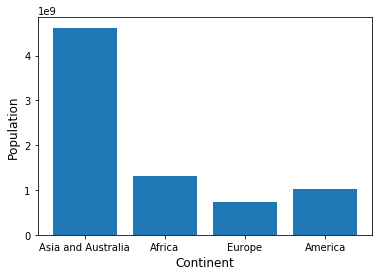


* The Result in the gapminder is somewhat true in reality the population of Asia and Australia is over 4 million and population of Europe is under a million. 

### Problem 2
Visualize the distribution of income (GDP / capita) across countries and continents, and how the distribution
of income changes over time.

Interpret the visualization and what you notice. Are they any notable trends and/or deviations from that
trend?

What caveats apply to your conclusions?


```python
gdp = pd.read_csv("ddf--datapoints--gdppercapita_us_inflation_adjusted--by--geo--time.csv")
gdp.head()
```


<div>
<style scoped>
    .dataframe tbody tr th:only-of-type {
        vertical-align: middle;
    }

    .dataframe tbody tr th {
        vertical-align: top;
    }

    .dataframe thead th {
        text-align: right;
    }
</style>
<table border="1" class="dataframe">
  <thead>
    <tr style="text-align: right;">
      <th></th>
      <th>geo</th>
      <th>time</th>
      <th>gdppercapita_us_inflation_adjusted</th>
    </tr>
  </thead>
  <tbody>
    <tr>
      <th>0</th>
      <td>abw</td>
      <td>2010</td>
      <td>24271.94042</td>
    </tr>
    <tr>
      <th>1</th>
      <td>afg</td>
      <td>2002</td>
      <td>364.57057</td>
    </tr>
    <tr>
      <th>2</th>
      <td>afg</td>
      <td>2003</td>
      <td>376.75871</td>
    </tr>
    <tr>
      <th>3</th>
      <td>afg</td>
      <td>2004</td>
      <td>364.09544</td>
    </tr>
    <tr>
      <th>4</th>
      <td>afg</td>
      <td>2005</td>
      <td>389.41636</td>
    </tr>
  </tbody>
</table>
</div>


```python
# ADDING CONTINENT CODES:
gdp = gdp.merge(geo_mapping[['geo','iso3166_1_alpha2']],on = 'geo')\
.rename(columns = {'iso3166_1_alpha2':'alpha2'})


```


```python

# dropped values that gave exceptions while converting
gdp = gdp[gdp.alpha2 != 'VA']
gdp = gdp[gdp.alpha2.notnull()]
gdp = gdp[gdp.alpha2 != 'TL']

```


```python
# Converting alpha2 names (country codes) to continent names
gdp.alpha2 = gdp.alpha2.apply(country_alpha2_to_continent_code)
```


```python
gdp.head()
```


<div>
<style scoped>
    .dataframe tbody tr th:only-of-type {
        vertical-align: middle;
    }

    .dataframe tbody tr th {
        vertical-align: top;
    }

    .dataframe thead th {
        text-align: right;
    }
</style>
<table border="1" class="dataframe">
  <thead>
    <tr style="text-align: right;">
      <th></th>
      <th>geo</th>
      <th>time</th>
      <th>gdppercapita_us_inflation_adjusted</th>
      <th>alpha2</th>
    </tr>
  </thead>
  <tbody>
    <tr>
      <th>0</th>
      <td>abw</td>
      <td>2010</td>
      <td>24271.94042</td>
      <td>NA</td>
    </tr>
    <tr>
      <th>1</th>
      <td>afg</td>
      <td>2002</td>
      <td>364.57057</td>
      <td>AS</td>
    </tr>
    <tr>
      <th>2</th>
      <td>afg</td>
      <td>2003</td>
      <td>376.75871</td>
      <td>AS</td>
    </tr>
    <tr>
      <th>3</th>
      <td>afg</td>
      <td>2004</td>
      <td>364.09544</td>
      <td>AS</td>
    </tr>
    <tr>
      <th>4</th>
      <td>afg</td>
      <td>2005</td>
      <td>389.41636</td>
      <td>AS</td>
    </tr>
  </tbody>
</table>
</div>


```python
gdp[gdp.alpha2 == 'NA'][["geo","time","gdppercapita_us_inflation_adjusted"]]\
.pivot(index='time', columns='geo', values='gdppercapita_us_inflation_adjusted')\
.plot(figsize=(20,7))

plt.title("Change in GDP with time for countries in North America.", fontsize=16, fontweight='bold')

plt.legend(ncol=3, loc='upper left')
plt.xlabel("Time")
plt.ylabel("gdppercapita_us_inflation_adjusted")

plt.show()
```


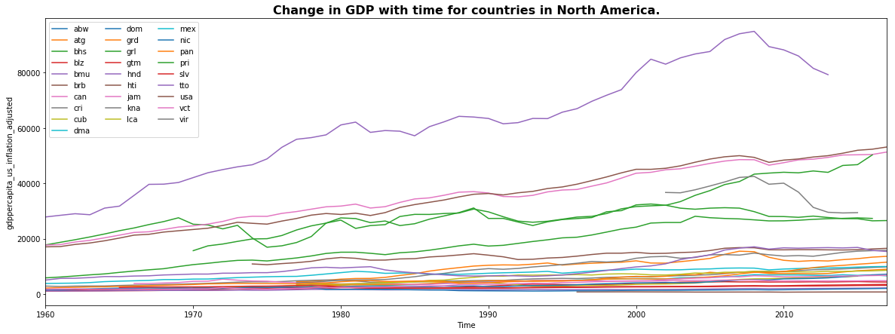


```python
gdp[gdp.alpha2 == 'SA'][["geo","time","gdppercapita_us_inflation_adjusted"]]\
.pivot(index='time', columns='geo', values='gdppercapita_us_inflation_adjusted')\
.plot(figsize=(20,7))

plt.title("Change in GDP with time for countries in South America.", fontsize=16, fontweight='bold')

plt.legend(ncol=3, loc='upper left')
plt.xlabel("Time")
plt.ylabel("gdppercapita_us_inflation_adjusted")

plt.show()
```


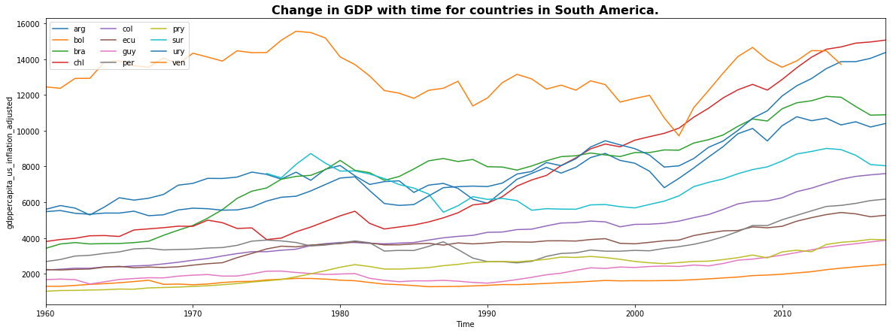


```python
gdp[gdp.alpha2 == 'EU'][["geo","time","gdppercapita_us_inflation_adjusted"]]\
.pivot(index='time', columns='geo', values='gdppercapita_us_inflation_adjusted')\
.plot(figsize=(20,7))

plt.title("Change in GDP with time for countries in Europe.", fontsize=16, fontweight='bold')

plt.legend(ncol=3, loc='upper left')
plt.xlabel("Time")
plt.ylabel("gdppercapita_us_inflation_adjusted")

plt.show()
```


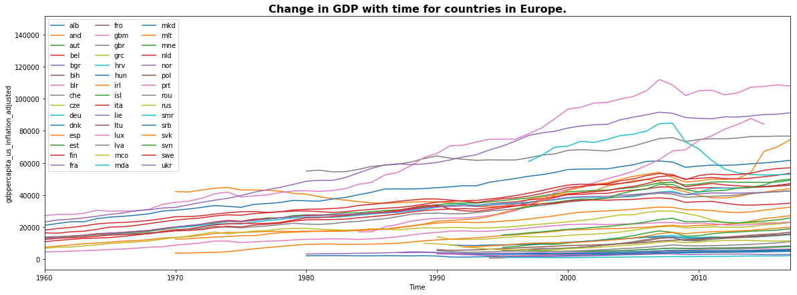


```python
gdp[gdp.alpha2 == 'OC'][["geo","time","gdppercapita_us_inflation_adjusted"]]\
.pivot(index='time', columns='geo', values='gdppercapita_us_inflation_adjusted')\
.plot(figsize=(20,7))

plt.title("Change in GDP with time for countries in Australia.", fontsize=16, fontweight='bold')

plt.legend(ncol=3, loc='upper left')
plt.xlabel("Time")
plt.ylabel("gdppercapita_us_inflation_adjusted")

plt.show()
```


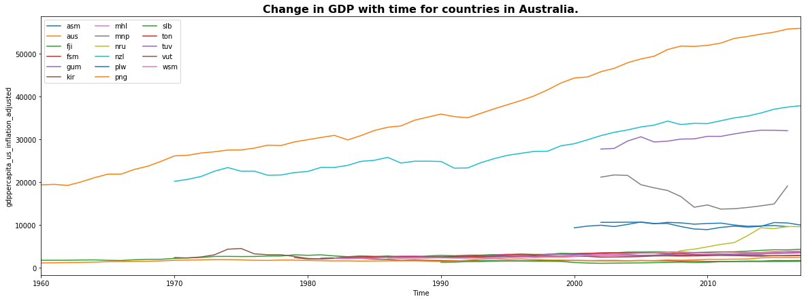


```python
gdp[gdp.alpha2 == 'AS'][["geo","time","gdppercapita_us_inflation_adjusted"]]\
.pivot(index='time', columns='geo', values='gdppercapita_us_inflation_adjusted')\
.plot(figsize=(20,7))

plt.title("Change in GDP with time for countries in Asia.", fontsize=16, fontweight='bold')

plt.legend(ncol=3, loc='upper left')
plt.xlabel("Time")
plt.ylabel("gdppercapita_us_inflation_adjusted")

plt.show()
```


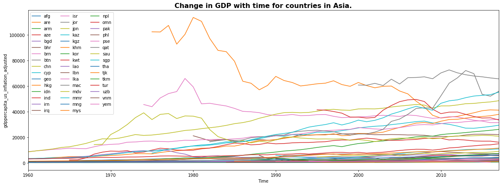


```python
gdp[gdp.alpha2 == 'AF'][["geo","time","gdppercapita_us_inflation_adjusted"]]\
.pivot(index='time', columns='geo', values='gdppercapita_us_inflation_adjusted')\
.plot(figsize=(20,7))

plt.title("Change in GDP with time for countries in Africa.", fontsize=16, fontweight='bold')

plt.legend(ncol=3, loc='upper left')
plt.xlabel("Time")
plt.ylabel("gdppercapita_us_inflation_adjusted")

plt.show()
```


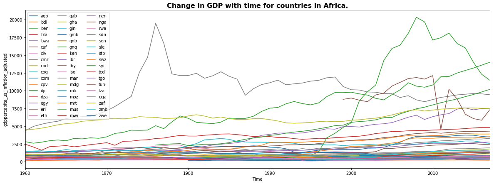


```python
gdp = gdp.groupby(['alpha2','time']).sum().reset_index()
gdp.head()
```


<div>
<style scoped>
    .dataframe tbody tr th:only-of-type {
        vertical-align: middle;
    }

    .dataframe tbody tr th {
        vertical-align: top;
    }

    .dataframe thead th {
        text-align: right;
    }
</style>
<table border="1" class="dataframe">
  <thead>
    <tr style="text-align: right;">
      <th></th>
      <th>alpha2</th>
      <th>time</th>
      <th>gdppercapita_us_inflation_adjusted</th>
    </tr>
  </thead>
  <tbody>
    <tr>
      <th>0</th>
      <td>AF</td>
      <td>1960</td>
      <td>34338.22708</td>
    </tr>
    <tr>
      <th>1</th>
      <td>AF</td>
      <td>1961</td>
      <td>34456.80565</td>
    </tr>
    <tr>
      <th>2</th>
      <td>AF</td>
      <td>1962</td>
      <td>34890.04361</td>
    </tr>
    <tr>
      <th>3</th>
      <td>AF</td>
      <td>1963</td>
      <td>36218.35173</td>
    </tr>
    <tr>
      <th>4</th>
      <td>AF</td>
      <td>1964</td>
      <td>37389.03138</td>
    </tr>
  </tbody>
</table>
</div>


```python
gdp.rename(columns = {'alpha2':'continents'})\
.pivot(index='time', columns='continents', values='gdppercapita_us_inflation_adjusted')\
.plot()

plt.title("Change in GDP with time.", fontsize=16, fontweight='bold')

plt.xlabel("Time")
plt.ylabel("Total gdp inflation adjusted")

plt.show()
```


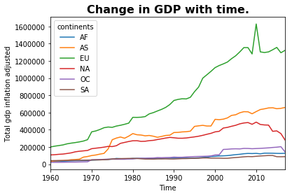


####  We can see almost all the continents has seen rise in gdp with time. Europe has the highest rise however asia is catching up as well. We can see spike in Asia after 1970s but it is then following trend like other countries.

* Caveat: the visualizations do not account for special situation like wars or natural disaster.

### Problem 3
Use visualization to investigate the relationship between income (GDP / capita), life expectancy, and child
mortality over time. How does each measure change over time within each continent?
Interpret your visualizations, noting any trends and/or outliers.


```python
life_expectancy = pd.read_csv("ddf--datapoints--life_expectancy_years--by--geo--time.csv")
child_mortality = pd.read_csv("ddf--datapoints--child_mortality_0_5_year_olds_dying_per_1000_born--by--geo--time.csv")
gdppercapita = pd.read_csv("ddf--datapoints--gdppercapita_us_inflation_adjusted--by--geo--time.csv")

dependence = pd.merge(child_mortality, life_expectancy, on = ['geo', 'time']) 
dependence = pd.merge(dependence, gdppercapita, on = ['geo', 'time'])
dependence.head()


```


<div>
<style scoped>
    .dataframe tbody tr th:only-of-type {
        vertical-align: middle;
    }

    .dataframe tbody tr th {
        vertical-align: top;
    }

    .dataframe thead th {
        text-align: right;
    }
</style>
<table border="1" class="dataframe">
  <thead>
    <tr style="text-align: right;">
      <th></th>
      <th>geo</th>
      <th>time</th>
      <th>child_mortality_0_5_year_olds_dying_per_1000_born</th>
      <th>life_expectancy_years</th>
      <th>gdppercapita_us_inflation_adjusted</th>
    </tr>
  </thead>
  <tbody>
    <tr>
      <th>0</th>
      <td>abw</td>
      <td>2010</td>
      <td>17.969</td>
      <td>75.06</td>
      <td>24271.94042</td>
    </tr>
    <tr>
      <th>1</th>
      <td>afg</td>
      <td>2002</td>
      <td>122.200</td>
      <td>52.43</td>
      <td>364.57057</td>
    </tr>
    <tr>
      <th>2</th>
      <td>afg</td>
      <td>2003</td>
      <td>118.300</td>
      <td>53.03</td>
      <td>376.75871</td>
    </tr>
    <tr>
      <th>3</th>
      <td>afg</td>
      <td>2004</td>
      <td>114.400</td>
      <td>53.50</td>
      <td>364.09544</td>
    </tr>
    <tr>
      <th>4</th>
      <td>afg</td>
      <td>2005</td>
      <td>110.300</td>
      <td>53.87</td>
      <td>389.41636</td>
    </tr>
  </tbody>
</table>
</div>


```python
dependence = dependence\
                   .merge(geo_mapping[['geo','iso3166_1_alpha2']],on = 'geo')\
                   .rename(columns = {'iso3166_1_alpha2':'alpha2'})

# dropped values that gave exceptions while converting
dependence = dependence[dependence.alpha2 != 'VA']
dependence = dependence[dependence.alpha2.notnull()]
dependence = dependence[dependence.alpha2 != 'TL']

# Converting alpha2 names (country codes) to continent names
dependence.alpha2 = dependence.alpha2.apply(country_alpha2_to_continent_code)
```


```python
dependence = dependence.groupby(['alpha2','time']).mean().reset_index()
dependence.head()

```


<div>
<style scoped>
    .dataframe tbody tr th:only-of-type {
        vertical-align: middle;
    }

    .dataframe tbody tr th {
        vertical-align: top;
    }

    .dataframe thead th {
        text-align: right;
    }
</style>
<table border="1" class="dataframe">
  <thead>
    <tr style="text-align: right;">
      <th></th>
      <th>alpha2</th>
      <th>time</th>
      <th>child_mortality_0_5_year_olds_dying_per_1000_born</th>
      <th>life_expectancy_years</th>
      <th>gdppercapita_us_inflation_adjusted</th>
    </tr>
  </thead>
  <tbody>
    <tr>
      <th>0</th>
      <td>AF</td>
      <td>1960</td>
      <td>7924.386</td>
      <td>1441.57</td>
      <td>34338.22708</td>
    </tr>
    <tr>
      <th>1</th>
      <td>AF</td>
      <td>1961</td>
      <td>7804.072</td>
      <td>1457.10</td>
      <td>34456.80565</td>
    </tr>
    <tr>
      <th>2</th>
      <td>AF</td>
      <td>1962</td>
      <td>7687.434</td>
      <td>1472.46</td>
      <td>34890.04361</td>
    </tr>
    <tr>
      <th>3</th>
      <td>AF</td>
      <td>1963</td>
      <td>7575.411</td>
      <td>1487.48</td>
      <td>36218.35173</td>
    </tr>
    <tr>
      <th>4</th>
      <td>AF</td>
      <td>1964</td>
      <td>7466.430</td>
      <td>1502.33</td>
      <td>37389.03138</td>
    </tr>
  </tbody>
</table>
</div>


```python
dependence.rename(columns = {'alpha2':'continents'})\
.pivot(index='time', columns='continents', values='child_mortality_0_5_year_olds_dying_per_1000_born')\
.plot()

plt.title("child mortality.", fontsize=16, fontweight='bold')

plt.xlabel("Time")
plt.ylabel("mortality per 1000")

plt.show()
```


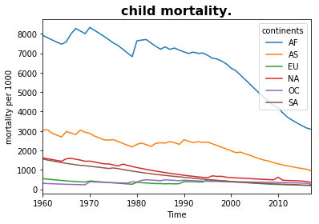


```python
dependence.rename(columns = {'alpha2':'continents'})\
.pivot(index='time', columns='continents', values='life_expectancy_years')\
.plot()

plt.title("life_expectancy_years", fontsize=16, fontweight='bold')

plt.xlabel("Time")
plt.ylabel("life expectancy")

plt.show()
```


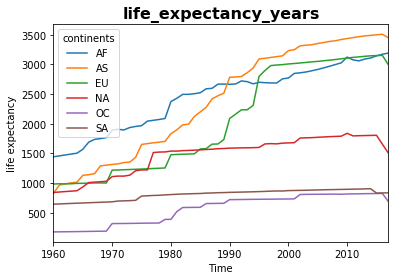


```python
dependence.rename(columns = {'alpha2':'continents'})\
.pivot(index='time', columns='continents', values='gdppercapita_us_inflation_adjusted')\
.plot()

plt.title("Change in GDP with time.", fontsize=16, fontweight='bold')

plt.xlabel("Time")
plt.ylabel("Total gdp inflation adjusted")

plt.show()
```


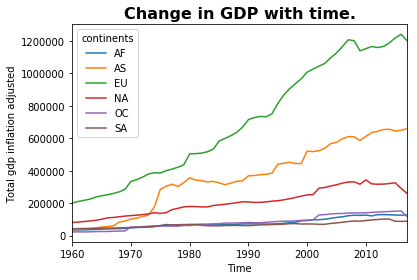


```python
import seaborn as sns
plt.figure(figsize=(16,12))
ax = sns.heatmap(dependence.drop('time',axis = 1).corr(), vmax=1, square=True, annot=True,fmt='.2f', cmap ='GnBu', cbar_kws={"shrink": .5}, robust=True)
plt.title('Correlation matrix between the features', fontsize=20)
plt.show()
print()
```


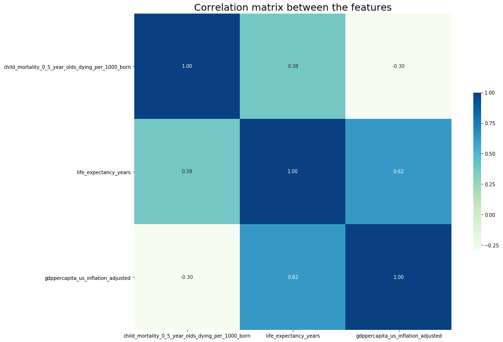


    


* We can observe that life expectancy and GDP are improving with time and child mortality is reducing. Overall the results are good and as per the expectation. 

* Also we can observe higher correlation between life expectancy and gdp/capita

### Problem 4
Choose two variables you have not investigated yet, and visualize their distributions, their relationship with
each other, and how these change over time.

Interpret your visualizations, noting any trends and/or outliers.


```python
bmi_men = pd.read_csv("ddf--datapoints--body_mass_index_bmi_men_kgperm2--by--geo--time.csv")
bmi_women= pd.read_csv("ddf--datapoints--body_mass_index_bmi_women_kgperm2--by--geo--time.csv")
bmi = pd.merge(bmi_men, bmi_women, on = ['geo', 'time']) 
bmi = bmi\
        .merge(geo_mapping[['geo','iso3166_1_alpha2']],on = 'geo')\
        .rename(columns = {'iso3166_1_alpha2':'alpha2'})

# dropped values that gave exceptions while converting
bmi = bmi[bmi.alpha2 != 'VA']
bmi = bmi[bmi.alpha2.notnull()]
bmi = bmi[bmi.alpha2 != 'TL']

# Converting alpha2 names (country codes) to continent names
bmi.alpha2 = bmi.alpha2.apply(country_alpha2_to_continent_code)
```


```python
bmi = bmi.groupby(['alpha2','time']).mean().reset_index().rename(columns={'body_mass_index_bmi_men_kgperm2':'BMI_men','body_mass_index_bmi_women_kgperm2':'BMI_women'})
```


```python
bmi.head()
```


<div>
<style scoped>
    .dataframe tbody tr th:only-of-type {
        vertical-align: middle;
    }

    .dataframe tbody tr th {
        vertical-align: top;
    }

    .dataframe thead th {
        text-align: right;
    }
</style>
<table border="1" class="dataframe">
  <thead>
    <tr style="text-align: right;">
      <th></th>
      <th>alpha2</th>
      <th>time</th>
      <th>BMI_men</th>
      <th>BMI_women</th>
    </tr>
  </thead>
  <tbody>
    <tr>
      <th>0</th>
      <td>AF</td>
      <td>1980</td>
      <td>21.131538</td>
      <td>21.553846</td>
    </tr>
    <tr>
      <th>1</th>
      <td>AF</td>
      <td>1981</td>
      <td>21.171154</td>
      <td>21.637308</td>
    </tr>
    <tr>
      <th>2</th>
      <td>AF</td>
      <td>1982</td>
      <td>21.212692</td>
      <td>21.718654</td>
    </tr>
    <tr>
      <th>3</th>
      <td>AF</td>
      <td>1983</td>
      <td>21.249423</td>
      <td>21.795192</td>
    </tr>
    <tr>
      <th>4</th>
      <td>AF</td>
      <td>1984</td>
      <td>21.285962</td>
      <td>21.871731</td>
    </tr>
  </tbody>
</table>
</div>


```python
bmi[bmi.alpha2 == 'AF'].set_index('time').plot()

plt.title("Change in Avg. BMI for men and women in Africa.", fontsize=16, fontweight='bold')

plt.xlabel("Time")
plt.ylabel("BMI")

plt.show()
```


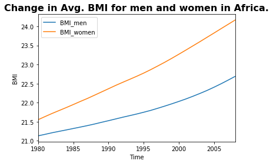


```python
bmi[bmi.alpha2 == 'AS'].set_index('time').plot()

plt.title("Change in Avg. BMI for men and women in Asia", fontsize=16, fontweight='bold')

plt.xlabel("Time")
plt.ylabel("BMI")

plt.show()
```


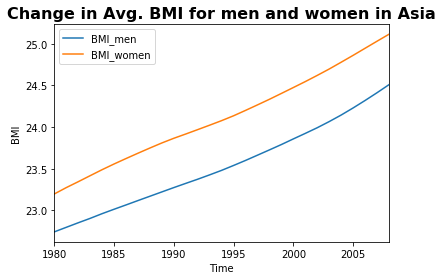


```python
bmi[bmi.alpha2 == 'OC'].set_index('time').plot()

plt.title("Change in Avg. BMI for men and women in Australia", fontsize=16, fontweight='bold')

plt.xlabel("Time")
plt.ylabel("BMI")

plt.show()
```


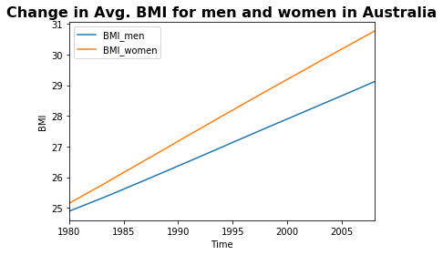


```python
bmi[bmi.alpha2 == 'NA'].set_index('time').plot()

plt.title("Change in Avg. BMI for men and women in North America", fontsize=16, fontweight='bold')

plt.xlabel("Time")
plt.ylabel("BMI")

plt.show()
```


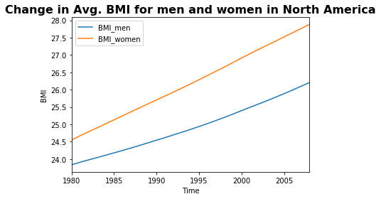


```python
bmi[bmi.alpha2 == 'SA'].set_index('time').plot()

plt.title("Change in Avg. BMI for men and women in South America", fontsize=16, fontweight='bold')

plt.xlabel("Time")
plt.ylabel("BMI")

plt.show()
```


```python
bmi[bmi.alpha2 == 'EU'].set_index('time').plot()

plt.title("Change in Avg. BMI for men and women in Europe", fontsize=16, fontweight='bold')

plt.xlabel("Time")
plt.ylabel("BMI")

plt.show()
```


#### We can observe that the trend in general Body mass index of men is less than women in all the continents however in Europe BMI of men is more than women after 1980s as per the dataset it is interesting to know that increase in BMI is a steep curve however it is not likewise for women.

### Problem 5
Did you use static or interactive plots to answer the previous problems?

Explore the data using the interactive visualization tools at https://www.gapminder.org/tools, and watch
the TED talk “The best stats you’ve ever seen” at https://www.youtube.com/watch?v=hVimVzgtD6w.

Discuss the advantages, disadvantages, and relative usefulness of using interactive/dynamic visualizations
versus static visualizations.

#### I used static plots
### Advantages and usefulness of interactive plots:

* They are easy to understand and are more interpretable.
* They are more illustrative.
* User can choose what to see instead of having a lot of information at once.
* It can be used by the user to pull information at that point of time.
* User Engagement

### Disadvantages
* It can sometimes complicate simple visualizations.
* Uses more resources to pull information realtime.
* Cannot be presented in form of posters or simple pdfs.
* Needs to be deployed across platforms
